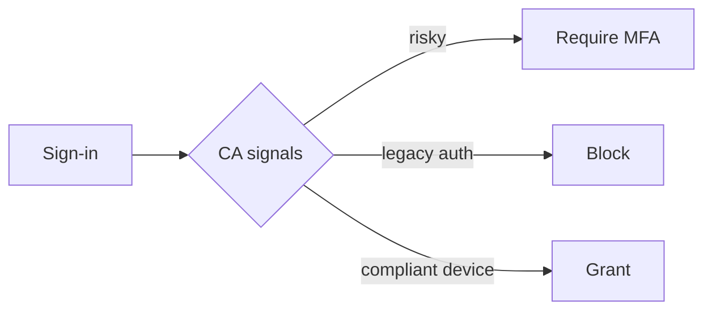

# Presentation Design (Microsoft-enhanced)

Effective presentations combine research-backed design principles, storytelling, and audience understanding. Create compelling narratives that engage audiences and communicate ideas clearly.

This is a Microsoft-focused enhancement of the original *Presentation Design* skill by Roland Huss (MIT-licensed, from `rhuss/cc-slidev`). The general design discipline is preserved; two layers are added for IT Pros and cloud/enterprise architects:
1. A **Microsoft Technical Presentations** section (audience patterns, deck archetypes, product-accurate language, code/diagram conventions for Intune, Entra ID, Azure, M365).
2. An **Icons & Visual Assets** section that sources official Microsoft product and architecture icons, primarily from [msicons.com](https://msicons.com), with a scriptable fallback (`scripts/fetch_icon.py`).

**Research Basis**: Guidelines are based on cognitive load studies (Miller's Law), TED presentation research, MIT Communication Lab recommendations, PLOS Computational Biology "Ten Simple Rules", and analysis of effective technical conference talks. See `references/presentation-best-practices.md` for citations and `references/microsoft-presentations.md` for the Microsoft playbook.

## HARD LIMITS (Never Violate)

Research-backed **maximum limits** that should NEVER be exceeded. If content exceeds these, you MUST split into multiple slides:

🔴 **MAX 6 elements** per slide (bullets + images + diagrams + code blocks combined)
🔴 **MAX 50 words** body text per slide (excluding title)
🔴 **MAX 1-2 code blocks** per slide (8-10 lines each)
🔴 **ONE idea** per slide (if multiple ideas → split slides)

**Why these are hard limits:**
- Cognitive load research: >6 elements exponentially increases audience confusion
- Reading vs listening interference: >50 words means audience stops listening
- Code complexity: >2 code examples creates comparison overhead

**When content doesn't fit:**
- ❌ **NEVER** compress or shrink to fit
- ❌ **NEVER** reduce font size below 18pt
- ✅ **ALWAYS** split into additional slides
- ✅ **ALWAYS** move details to presenter notes or backup slides

This matters most in IT decks: a single Intune blade screenshot or an Entra Conditional Access policy can tempt you into a wall of settings. Split it.

## Core Principles

### 1. One Idea Per Slide

Each slide communicates exactly ONE central idea, finding, or question.

- If a slide requires >2 minutes to explain → split it
- Each slide title states one clear point
- Content supports only the title's assertion

**Example (Microsoft):**
- ❌ Bad: One "Conditional Access" slide covering signals + conditions + grant controls + session controls + report-only rollout
- ✅ Good: "CA blocks legacy auth tenant-wide" → "Risk-based MFA covers the high-risk 4%" → "Report-only mode caught 12 broken sign-ins before enforcement"

### 2. Meaningful Titles (Assertions, Not Labels)

Slide titles should state the TAKEAWAY, not just the topic. Reading titles in sequence should tell the whole story.

**Format:** complete assertion (subject + verb + finding), not a one-word label.

**Examples (Microsoft):**
- ❌ Weak: "Conditional Access" / "Architecture" / "Results"
- ✅ Strong: "Conditional Access blocks 100% of legacy auth" / "Hub-spoke isolates each business unit" / "Autopilot cut provisioning from 3 days to 40 minutes"

**Validation**: Could the audience get the main point from the title alone?

### 3. Cognitive Load Management

Limit distinct elements to ~6 per slide (Miller's Law, 7±2). Count bullets, images, diagrams, text blocks, charts, callouts. If >6 needed: use progressive builds, split, or simplify.

### 4. Design for the Distracted Viewer

Each slide must convey its message even if the viewer doesn't hear narration (post-lunch admins, slides reviewed later without audio).

- Meaningful title + clear visual = standalone message
- Highlight conclusions, not raw config dumps
- Use arrows/labels to guide attention
- **Test**: Show the slide to someone with no context. Main point in 5 seconds?

### 5. Minimal Text (Keywords, Not Sentences)

Aside from the title, use short phrases. Slides are visual aids, not scripts (dual-channel interference: people can't read and listen at once).

- Body word count (excluding title): <50 words
- Bullets are phrases, not sentences
- **Detailed text belongs in presenter notes**

### 6. Backup Slides Strategy

Prepare backup slides for Q&A but keep them after a "Questions?" slide and out of timing. Ideal for IT detail: full policy JSON, KQL queries, licensing tables, naming conventions, migration runbooks.

## Presentation Structure

### Three-Act Structure

**Act 1: Setup** (15-20%) — Hook, state the problem/opportunity, establish credibility, preview.
**Act 2: Confrontation** (60-70%) — Main content, build complexity, evidence, address counterarguments.
**Act 3: Resolution** (15-20%) — Synthesize, clear takeaways, call to action.

### Slide Sequence Pattern

```
1. Title/Cover     5-N. Content
2. Hook            N+1. Summary
3. Problem         N+2. Next Steps
4. Agenda          N+3. Q&A
```

## Storytelling Principles

**Start with Why** — Lead with the problem, not your org chart or product tour.
**Use concrete examples** — "The helpdesk reset 1,400 passwords last quarter" beats "we improve efficiency."
**Create contrast** — Before/After, Old Way/New Way, Problem/Solution, On-prem/Cloud.

## Visual Hierarchy

### Text Density

- Title slides: 5-7 words max
- Content slides: 20-30 words max
- Data slides: let the visual speak
- **6×6 rule:** ≤6 bullets, ≤6 words per bullet

### Typography

- H1 (Title): 44-60pt · H2: 32-40pt · H3: 24-28pt · Body: 18-24pt
- Sans-serif for body (Segoe UI fits Microsoft decks); ≤2 font families
- Use weight, not italics/underline, for emphasis

### Color Strategy

- Primary / Secondary / Neutral / Accent (used sparingly)
- Text contrast ≥4.5:1 (≥3:1 for >24pt)
- Colorblind-safe (Blue + Orange is a safe default)
- Many Microsoft product icons are blue — set diagram backgrounds and connectors so blue icons keep contrast; add labels, never rely on color alone

### White Space

Margins ≥10% on all sides; 20-30px between elements. Resist filling every pixel.

## Slide Types

**Data slides** — charts over tables; one data point per slide; remove chart junk. Trends→line, comparisons→bar, proportions→pie (≤5 segments), process→flowchart.
**Concept slides** — metaphors, diagrams, progressive disclosure, one concept.
**Transition slides** — section title only, progress indicator (Section 2 of 4).

## Audience Engagement

### Opening Hooks

Provocative question, surprising statistic, short story, live demo, or current-event tie-in.
- ❌ "Thanks for having me. Today I'll cover..."
- ✅ "90% of breaches start with an identity. Yours included."

### Pacing and Timing

**Default: 90 seconds per slide** (configurable). At 90s/slide:
- 10 min ≈ 6-7 slides · 15 min ≈ 10 · 20 min ≈ 13 · 30 min ≈ 20 · 45 min ≈ 30

```
Expected slides = (duration_minutes × 60) / seconds_per_slide
Acceptable range = expected ± 20%
```

Adjust for complexity, audience expertise, interaction, and demo time. If you spend 2-3× target on one slide in practice → split it.

### Progressive Disclosure

Reveal incrementally to control attention. Tool-specific:
- **Slidev / Markdown:** wrap items in `<v-click>...</v-click>`
- **PowerPoint:** Animations → Appear (on click), one bullet at a time
- **Keynote:** Build In → Appear

### Interaction Patterns

Rhetorical questions, polls, live demos, concrete examples, challenges.

## Content Organization

**Pyramid Principle** — Lead with the conclusion, then supporting points, then evidence, then detail. Map: Slide 1 = recommendation, Slides 2-4 = three reasons, Slides 5-N = evidence.

**Rule of Three** — 3 main points, 3 examples, 3 takeaways. Minimum for pattern, maximum for recall.

**Signposting** — "First…", "Now that we've secured identity, let's look at the device…", "To summarize…".

## Visual Design Patterns

**Layouts:** Full-bleed image · Split (content + diagram) · Grid · Centered · Quote.
**Image selection:** relevant (not decorative), ≥1920×1080, consistent tone, inclusive. Sources: Unsplash/Pexels (photos), official product icons (see Icons section), AI-generated for specific concepts.
**Consistency:** lock a 2-3 color palette, 1-2 fonts, one icon style, one diagram aesthetic across the whole deck.

## Common Mistakes

- **Information overload** — walls of text, tiny fonts, cluttered config screenshots → key points only, large fonts, white space, one idea.
- **Reading slides** — full sentences read verbatim → keywords + verbal expansion.
- **Inconsistency** — mixed fonts/colors/icon styles → single template.

## Presentation Types

**Business Pitch** — Problem → Solution → Market → Model → Traction → Competition → Team → Ask. Professional, data-driven, 10-20 min.
**Technical Tutorial** — Prerequisites → Context → Concepts → Implementation → Examples → Practice → Resources. Step-by-step, code-aware, 30-60 min.
**Academic** — Background → Question → Methods → Results → Discussion → Conclusions → Future work. Formal, referenced, 15-45 min.
**Conference Talk** — Hook → Personal connection → Core idea → 3-4 supporting points → Implications → Takeaway. Engaging, 20-45 min.

> For Microsoft-specific deck archetypes (architecture review, migration plan, security posture, product deep-dive, customer workshop, RFP/proposal), see **`references/microsoft-presentations.md`**.

## Microsoft Technical Presentations

IT Pro and cloud/enterprise-architect decks have their own failure modes and conventions. Apply these on top of the core principles.

### Know the audience

| Audience | Cares about | Pitch the slide at |
| --- | --- | --- |
| **IT admins / engineers** | How it works, day-2 ops, gotchas | Concrete config, PowerShell/Graph, runbooks |
| **Architects** | Patterns, trade-offs, blast radius | Diagrams, decision records, options compared |
| **Security / CISO** | Risk, compliance, identity, blast radius | Threat reduction, posture deltas, evidence |
| **Business / sponsors** | Cost, time, risk, outcome | Before/after, € impact, timeline, one diagram |

State the audience in `presentation-config` and keep one deck per audience. Mixing admin-depth config with a CISO summary kills both.

### Use product-accurate names (credibility)

Wrong names signal you're out of date. Use current branding:
- **Microsoft Entra ID** (not "Azure AD" / "AAD") — note the legacy name once for older audiences, then move on
- **Microsoft Intune** (the suite is **Microsoft Intune Suite**); "Endpoint Manager / MEM" is retired
- **Microsoft Defender** (XDR, for Endpoint, for Cloud, for Office 365) — be specific which one
- **Microsoft Purview** (compliance/data governance; not "Compliance Center")
- **Microsoft 365** (not "Office 365" when you mean the broader suite)
- **Windows Autopatch**, **Windows Autopilot**, **Conditional Access**, **Microsoft Entra Private/Internet Access (GSA)**

### Code blocks (PowerShell, Graph, KQL, Bicep)

- 1-2 blocks per slide, 8-10 lines each. If longer → backup slide or a `gist`/repo link.
- Show the *interesting* lines; replace boilerplate with `# ...`.
- Highlight the key line(s). Slidev: ```` ```powershell {3-4} ````. PowerPoint: bold/box the line.
- Prefer Microsoft Graph PowerShell SDK / `az`/`Microsoft.Graph` cmdlets over deprecated MSOnline/AzureAD modules in examples.
- KQL (Sentinel/Defender/Log Analytics): show the query AND the one insight it produced.

### Screenshots of portals (Intune / Entra / Azure)

- Crop to the one setting that matters; don't paste the whole blade.
- Annotate with an arrow/box and an assertion title ("Compliance policy marks jailbroken devices non-compliant").
- Redact tenant names, UPNs, object IDs, IPs. Treat as PII.
- Portals change UI often — prefer a clean diagram or icon over a screenshot for anything that must age well.

### Diagrams that recur in Microsoft decks

Use official icons (next section) and keep one idea per diagram:
- **Identity / Conditional Access flow** — signals → conditions → grant/session controls
- **Zero Trust** — identity, device, network, app, data with explicit-verify points
- **Hub-spoke / landing zone** — connectivity, shared services, workload spokes
- **Device lifecycle** — enroll (Autopilot) → configure (Intune) → protect (Defender) → retire
- **Tenant-to-tenant / hybrid** — on-prem AD ↔ Entra Connect ↔ Entra ID

Mermaid works well for flows and sequences and version-controls cleanly:



### Licensing / SKU honesty

If a feature needs a specific license (Entra ID P1/P2, Intune Plan 1/2, Defender for Endpoint P2, E5), say so on the slide or in notes. Architects and buyers will ask; pre-empting it builds trust.

## Icons & Visual Assets

Official product and architecture icons make Microsoft decks instantly credible and consistent. **Primary source: [msicons.com](https://msicons.com)** — a free community library by Daniel Bradley (Microsoft MVP) with ~2,400 official Microsoft architecture icons, searchable and downloadable as **SVG or PNG at any size**.

### How to get an icon from msicons.com

msicons.com is a client-rendered web app (no documented public API), so fetch icons one of these ways, in order of preference:

1. **Browser-driven (when a browser tool is available, e.g. Claude in Chrome):**
   - Navigate to `https://msicons.com`
   - Use the search box for the product (e.g. "Intune", "Entra", "Conditional Access", "Key Vault")
   - Open the icon, choose **SVG** (preferred for slides/diagrams — scales cleanly) or **PNG** at the size you need, and download
   - Save into the deck's `public/images/icons/` (Slidev) or `assets/icons/` (PowerPoint workflow)
2. **Bulk:** the **Download** page (`https://msicons.com/download`) offers the full library — grab it once and reuse offline.
3. **Manual hand-off:** if no browser is available, tell the user the exact search term to use on msicons.com and where to drop the file.

### Scriptable fallback (no browser needed)

When you need an icon non-interactively, use the bundled helper. It pulls via the GitHub API from **loryanstrant/MicrosoftCloudLogos** (Microsoft cloud product logos grouped by family — Entra, Intune, Defender, Purview, Microsoft 365, Power Platform, Fabric; legacy Azure AD filed under Entra), with **benc-uk/icon-collection** as a complement for Azure architecture service icons:

```bash
# Search what's available
python3 scripts/fetch_icon.py --list entra

# Download an icon (SVG) into the current deck
python3 scripts/fetch_icon.py "Microsoft Entra ID" --out ./public/images/icons/
python3 scripts/fetch_icon.py "Intune" --out ./public/images/icons/
```

See `scripts/fetch_icon.py --help` and `scripts/README.md` for sources and options. For anything the script can't find, fall back to msicons.com (steps above) or Microsoft's official downloads:
- Azure architecture icons: `https://learn.microsoft.com/azure/architecture/icons/`
- Microsoft 365 architecture icons & templates (Microsoft Learn)
- Microsoft Fabric / Power Platform icon sets (Microsoft Learn)

### Icon usage rules (on top of visual hierarchy)

- **Official only** for product icons — mismatched/old logos undermine credibility (e.g. don't use the old Azure AD logo for Entra).
- **One icon family** per deck; don't mix flat architecture icons with skeuomorphic ones.
- **Don't stretch** — SVG scales; PNG must keep aspect ratio.
- **Contrast** — many MS icons are blue/teal; on dark slides add a light chip/circle behind them, and always pair an icon with a text label (color-blind + distracted-viewer safe).
- **Licensing** — Microsoft icons are for diagrams/architecture per Microsoft's terms; don't imply partnership/endorsement or alter the marks. Keep attribution where required.
- Count an icon as one of the ≤6 elements on a slide.

## Accessibility Considerations

- **Fonts:** body ≥18pt, headings ≥24pt; sans-serif body; avoid italics/underline/ALL CAPS in body.
- **Contrast:** ≥4.5:1 normal, ≥3:1 large; verify with a checker.
- **Color:** colorblind-safe palette; never rely on color alone — add labels/patterns/shapes.
- **Layout:** clear sections, consistent layout, generous margins; add a frame behind icons/text over busy backgrounds.
- **Test:** view from the back of the room, run a colorblind simulator, check on different displays.
- **Cognitive:** simple language (define jargon — even "tenant" for mixed audiences), signposting, predictable pacing, one idea per slide, progressive disclosure.

## Presenter Notes

**Detailed text belongs in presenter notes, NOT on slides** (MIT CommLab). Use notes for: full sentences you'll speak, detailed explanations, exact numbers/SKUs, timing cues, transitions, technical details, anticipated questions, stories. Script the first 2-3 slides word-for-word to steady your open.

```markdown
# Conditional Access blocks 100% of legacy auth


<!--
NOTES:
Open: "We thought legacy auth was already dead. It wasn't."
- Baseline: 9,200 legacy-auth sign-ins/week pre-policy
- Rolled out report-only for 2 weeks → fixed 12 service accounts
- Enforced tenant-wide → legacy auth sign-ins now blocked
- License: Entra ID P1 (mention if asked)
Transition: "With identity locked down, the device is next..."
Timing: 90s
-->
```

## Best Practices Summary

### The 10 Essential Principles
1. One idea per slide
2. Meaningful (assertion) titles
3. Minimal text (<50 words, keywords)
4. Visual over text
5. Max 6 elements
6. Accessibility (18pt+, 4.5:1, colorblind-safe)
7. Design for the distracted viewer
8. Progressive disclosure
9. Timing (90s/slide default)
10. Backup slides for detail/Q&A

### DO
Start with a hook · rule of three · detail in presenter notes · practice timing · leave white space · official product names + icons · end with a clear conclusion (not "Thank you") · test accessibility · create backup slides · consistent theme.

### DON'T
Overload with text · tiny fonts · read slides verbatim · vague titles · cram multiple ideas · exceed 6 elements · paste whole portal blades · use stale product names/logos · rely on color alone · ignore contrast.

### Validation Checklist (per slide)
- [ ] One clear idea/finding
- [ ] Meaningful title (assertion)
- [ ] <50 words body text
- [ ] ≤6 distinct elements (icons count)
- [ ] At least one visual (unless quote/transition)
- [ ] Body ≥18pt, heading ≥24pt
- [ ] Contrast ≥4.5:1, colorblind-safe
- [ ] Official, current product names & icons
- [ ] Screenshots cropped + redacted (no tenant/UPN/IP)
- [ ] Explainable in ~90 seconds
- [ ] Title + visual = standalone comprehension

### Validation Checklist (presentation)
- [ ] Slide count fits duration (±20%)
- [ ] Logical flow; titles tell the story
- [ ] Consistent theme/colors/fonts/icon family
- [ ] Strong opening hook (not a bio/agenda)
- [ ] Clear conclusion statement
- [ ] Licensing/SKU implications stated where relevant
- [ ] Backup slides separated
- [ ] Presenter notes on key slides

---

**Provenance:** Enhanced from *Presentation Design* by Roland Huss (`rhuss/cc-slidev`, MIT License). Microsoft playbook and icon tooling added in this version.

**Additional Resources:**
- `references/presentation-best-practices.md` — research basis and citations
- `references/microsoft-presentations.md` — Microsoft deck archetypes and patterns
- `scripts/fetch_icon.py` — official icon fetcher (msicons.com fallback)
- Nancy Duarte: *Resonate*, *Slide:ology* · Garr Reynolds: *Presentation Zen*
- PLOS Computational Biology: "Ten Simple Rules for Effective Presentation Slides" · MIT Communication Lab: Slide Presentation Guide
